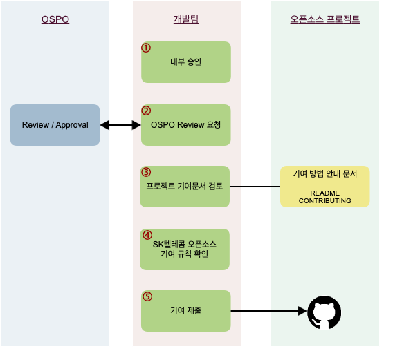

SK텔레콤의 오픈소스 기여 규칙에 따라 구성원은 외부 오픈소스 프로젝트에 기여할 때 다음과 같은 기여 절차를 따른다. 

{}
단, 다음과 같이 단순한 내용일 경우, 저작권 침해 리스크가 크지 않기 때문에 리뷰 절차 없이 구성원의 판단에 따라 기여할 수 있다. 

* 10 라인 이하의 작은 코드 조각
* Stack Overflow에서의 문의 / 답변
* GitHub에서의 관리 활동 : Issue 생성, Pull Request Review / Approve 등
{}

## 1. 소속 조직 내부 승인
하나의 오픈소스 프로젝트에 기여를 시작하기 전에 소속 조직의 담당 임원 혹은 리더에게 승인을 받는다. 

## 2. OSPO Review 요청
조직 내 승인을 받은 후에는 OSPO(Open Source Program Office)에 리뷰를 요청한다. : [Support (opensource@sktelecom.com)](https://sktelecom.github.io/about/contact/)

* 리뷰 요청 시에는 다음 내용을 포함한다. : [Template]
  * 오픈소스 프로젝트 이름
  * Repository
  * License
  * 기여 목적
  * 기여 내용
* OSPO는 오픈소스 프로젝트의 License / CLA를 검토하고, 이상이 없을 경우 승인한다. 
* OSPO는 SK텔레콤 구성원이 기여하고 있는 오픈소스 프로젝트 현황을 취합하고 있다. 취합 자료는 오픈소스 프로젝트 별 전문가 Pool로 활용한다.

{}
기여하고자 하는 오픈소스 프로젝트에 대해 한번 OSPO 리뷰 및 승인을 받은 후에는 해당 오픈소스 프로젝트에는 구성원의 재량에 따라 기여할 수 있다.
{}

## 3. 프로젝트 기여 문서 검토

오픈소스 프로젝트마다 요구하는 절차가 조금씩 다르다. 

* 프로젝트마다 코딩 스타일, language, formatting, bug/ticket 관리, 릴리즈 시기 등에 대한 다양한 가이드라인을 갖고 있다.
* 어떤 프로젝트는 CLA 서명을 요구하는 반면, 어떤 프로젝트는 DCO Signed-off-by를 요구를 한다.
* Patch를 받는 방식도 요즘은 대부분 Github의 Pull Request로 받지만, 어떤 프로젝트는 여전히 Mailing List를 이용하기도 한다.

그렇기 때문에 기여하고자 하는 프로젝트의 프로세스를 제대로 이해하기 위해서는 우선 프로젝트에서 제공하는 문서를 잘 확인해야 한다. 대개의 프로젝트는 CONTRIBUTING 또는 README 파일로 이러한 문서를 제공한다. 예를 들어, Kubernetes는 기여자를 위한 자세한 가이드를 제공한다. ([contributing.md](https://github.com/kubernetes/community/blob/master/contributors/guide/contributing.md) : Kubernetes에 기여하기 위한 가이드) 문서에서 요구하는 사항을 잘 준수할수록 우리의 기여가 수락될 가능성이 커진다.

## 4. 오픈소스 기여 Rule 준수
[SK텔레콤 오픈소스 기여 Rule](/guide/contribute/rule)을 확인하고 이에 따라 기여할 코드를 개선한다. 

## 5. 기여 제출
이제 프로젝트의 문서에서 요구하는 절차에 따라 기여를 제출한다. 일반적인 오픈소스 프로젝트에 기여하는 방법은 다음 페이지를 참고하라. 

* [기여 제출 세부 절차](/guide/contribute/process/submit)
* [커뮤니케이션 방법](/guide/contribute/background/communication)